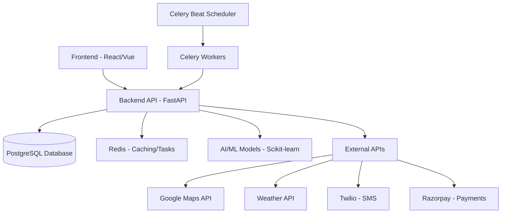

# AI-Powered Smart CNG Pump Appointment System


An intelligent CNG pump appointment system with e-token generation, queue management, and AI-powered demand prediction.

## Table of Contents

- [Overview](#overview)
- [Features](#features)
- [Architecture](#architecture)
- [Tech Stack](#tech-stack)
- [Project Structure](#project-structure)
- [Installation](#installation)
- [Usage](#usage)
- [API Documentation](#api-documentation)
- [Testing](#testing)
- [Deployment](#deployment)
- [Contributing](#contributing)
- [License](#license)

## Overview

The AI-Powered Smart CNG Pump Appointment System is designed to eliminate long queues at CNG pump stations by allowing customers to book time slots in advance. The system generates digital e-tokens with QR codes, dynamically adjusts token expiry based on traffic and weather conditions, and uses AI to predict demand patterns.

## Features

### Core Features

1. **User Registration & Authentication**
   - Email/password registration
   - JWT-based authentication
   - User profile management

2. **Pump Station Management**
   - Add/update/delete pump stations
   - Real-time fuel capacity tracking
   - Location-based services (GPS)

3. **Smart Booking System**
   - Real-time slot availability
   - GPS-based nearest pump discovery
   - Fuel quantity selection

4. **E-Token Management**
   - Unique QR code generation per booking
   - Dynamic expiry based on:
     - Google Maps ETA
     - Traffic conditions
     - Weather data
   - Token scanning and validation

5. **Payment Integration**
   - Razorpay/PayPal integration
   - Multiple payment methods (UPI, Cards, Wallets)
   - Auto-cancellation on payment failure

6. **AI Demand Prediction**
   - Machine learning model for rush hour prediction
   - Optimal slot allocation suggestions
   - Fuel demand forecasting

7. **Reminder System**
   - Automated SMS/email notifications
   - Confirmation prompts before slot time
   - "Coming/Not Coming" status updates

8. **Offline Booking**
   - SMS-based booking (`BOOK <StationCode> HH:MM`)
   - IVR call-in system
   - Simple token generation

### Advanced Features

1. **Security & Audit**
   - Role-based access control
   - Comprehensive audit logging
   - Fraud prevention measures

2. **Admin Dashboard**
   - Real-time booking visualization
   - Token usage analytics
   - Capacity utilization reports

3. **Dynamic Lane Management**
   - Walk-in vs booked lane allocation
   - Real-time capacity adjustments

## Architecture



### Layers

1. **Presentation Layer**
   - Web Portal: React.js
   - Mobile App: React Native/Flutter
   - Admin Dashboard: React-based interface

2. **Application Layer**
   - Backend: Python FastAPI
   - RESTful APIs
   - Business logic implementation

3. **AI Layer**
   - Python ML microservices
   - Demand prediction algorithms
   - Dynamic token time adjustment

4. **Database Layer**
   - Primary: PostgreSQL
   - Caching: Redis
   - Analytics: Optional MongoDB

5. **Integration Layer**
   - Google Maps API for distance/ETA
   - Weather APIs for environmental factors
   - Payment gateways (Razorpay/PayPal)
   - SMS/Notification services (Twilio)

## Tech Stack

### Frontend
- React.js (Web Portal)
- React Native / Flutter (Mobile Apps)
- TailwindCSS / Material-UI
- Axios for API calls

### Backend
- Python 3.9+
- FastAPI (REST API framework)
- SQLAlchemy (ORM)
- PostgreSQL (Primary database)
- Redis (Caching, Celery broker)
- Celery (Background tasks)
- Scikit-learn (Machine Learning)

### DevOps
- Docker & Docker Compose
- Nginx (Reverse proxy)
- Let's Encrypt (SSL certificates)
- GitHub Actions (CI/CD)

### External Services
- Google Maps API
- OpenWeatherMap API
- Twilio (SMS/IVR)
- Razorpay/PayPal (Payments)
- QR Code Generator

## Project Structure

```
smart-pump/
├── backend/
│   ├── main.py                 # Application entry point
│   ├── db.py                   # Database configuration
│   ├── models/                 # Database models
│   ├── schemas/                # Pydantic schemas
│   ├── routes/                 # API routes
│   ├── services/               # Business logic
│   ├── utils/                  # Utility functions
│   ├── ai_models/              # AI/ML models
│   ├── tasks/                  # Background tasks
│   ├── celery_app.py           # Celery configuration
│   ├── requirements.txt        # Python dependencies
│   ├── Dockerfile              # Docker configuration
│   ├── docker-compose.yml      # Docker Compose configuration
│   └── .env                    # Environment variables
├── frontend/
│   ├── public/                 # Static assets
│   ├── src/                    # Source code
│   │   ├── components/         # React components
│   │   ├── pages/              # Page components
│   │   ├── hooks/              # Custom hooks
│   │   ├── services/           # API service calls
│   │   ├── utils/              # Utility functions
│   │   └── App.js              # Main application component
│   ├── package.json            # Node.js dependencies
│   └── Dockerfile              # Frontend Docker configuration
├── mobile/                     # Mobile app (React Native/Flutter)
├── docs/                       # Documentation
├── tests/                      # Test suites
├── scripts/                    # Utility scripts
├── .gitignore                  # Git ignore rules
├── docker-compose.yml          # Main Docker Compose
└── README.md                   # Project documentation
```

## Installation

### Prerequisites

- Python 3.9+
- Node.js 16+
- Docker & Docker Compose (recommended)
- PostgreSQL 13+
- Redis 6+

### Backend Setup

1. Clone the repository:
   ```bash
   git clone <repository-url>
   cd smart-pump
   ```

2. Navigate to backend directory:
   ```bash
   cd backend
   ```

3. Create virtual environment:
   ```bash
   python -m venv venv
   source venv/bin/activate  # On Windows: venv\Scripts\activate
   ```

4. Install dependencies:
   ```bash
   pip install -r requirements.txt
   ```

5. Configure environment variables:
   ```bash
   cp .env.example .env
   # Edit .env with your configuration
   ```

6. Initialize database:
   ```bash
   python init_db.py
   ```

### Frontend Setup

1. Navigate to frontend directory:
   ```bash
   cd ../frontend
   ```

2. Install dependencies:
   ```bash
   npm install
   ```

3. Configure environment variables:
   ```bash
   cp .env.example .env
   # Edit .env with your configuration
   ```

## Usage

### Running the Application

#### Development Mode

1. Start backend:
   ```bash
   cd backend
   uvicorn main:app --reload
   ```

2. Start frontend:
   ```bash
   cd frontend
   npm start
   ```

3. Start Celery workers (separate terminals):
   ```bash
   cd backend
   celery -A celery_app worker --loglevel=info
   celery -A celery_app beat --loglevel=info
   ```

#### Production Mode (Docker)

```bash
docker-compose up -d
```

### API Endpoints

The backend API is available at `http://localhost:8000`.

Key endpoints:
- `POST /api/users/register` - User registration
- `POST /api/users/login` - User login
- `GET /api/pumps/` - List all pumps
- `POST /api/bookings/` - Create booking
- `POST /api/tokens/generate/{booking_id}` - Generate e-token

## API Documentation

Once the backend is running, you can access:

- **Swagger UI**: `http://localhost:8000/docs`
- **ReDoc**: `http://localhost:8000/redoc`

Detailed API specification is available in `backend/openapi.yaml`.

## Testing

### Backend Tests

Run backend tests:
```bash
cd backend
pytest tests/ -v
```

### Frontend Tests

Run frontend tests:
```bash
cd frontend
npm test
```

## Deployment

See `backend/DEPLOYMENT.md` for detailed deployment instructions.

### Docker Deployment

```bash
docker-compose up -d
```

### Environment Variables

Key environment variables:
- `DATABASE_URL` - PostgreSQL connection string
- `SECRET_KEY` - JWT secret key
- `GOOGLE_MAPS_API_KEY` - Google Maps API key
- `TWILIO_ACCOUNT_SID` - Twilio account SID
- `RAZORPAY_KEY_ID` - Razorpay key ID

## Contributing

1. Fork the repository
2. Create a feature branch (`git checkout -b feature/amazing-feature`)
3. Commit your changes (`git commit -m 'Add amazing feature'`)
4. Push to the branch (`git push origin feature/amazing-feature`)
5. Open a Pull Request

### Code Style

- Backend: Follow PEP 8 standards
- Frontend: Follow Airbnb JavaScript style guide
- Documentation: Use Markdown with clear examples

## License

This project is licensed under the MIT License - see the `LICENSE` file for details.

## Contact

For support or inquiries, please contact:
- Email: support@smartpump.example.com
- Website: https://smartpump.example.com

---

© 2025 Smart CNG Pump Appointment System. All rights reserved.